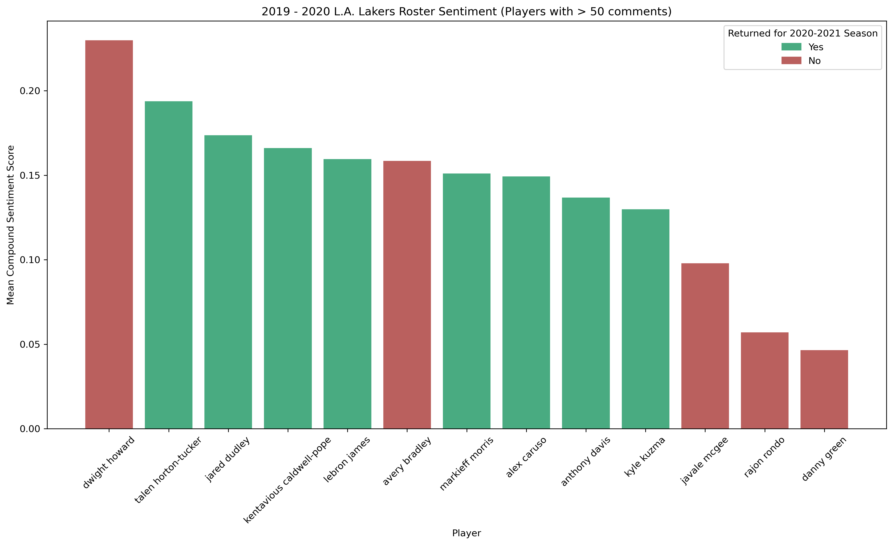

# Can NBA Player Sentiment Be a Predictor for Roster Turnover?
Over the course of a season, NBA fanbases will formulate opinions of their team's players based on their in-game performance. However, through team roster decisions, it can often feel as though these opinions aren't shared with the management personnal of the team. This raises the question, how closely aligned, if at all, are fanbases opinions of their players with management's annual roster movements? Do players who performed poorly in the eyes of the fanbase tend to fail to secure a roster spot for the following season? Similarly, do players who were viewed favourably by the fanbase typically return to the team? Lastly, using the fanbases opinions, can we predict which players from the 2020-2021 roster will be back next season?

To try to answer these questions I collected more than 110,000 Reddit comments from the Los Angeles Lakers subreddit, /r/lakers, and performed a sentiment analysis to gauge the fanbase's opinion of their players. Comments were gathered from approximately 420 post-game threads spanning 6 seasons. As suggested by the name, a post-game thread is a comment thread posted after the game that allows for the expression of thoughts towards the teams or individual players performance. 

## Tools used:
* Languages: Python
* Packages: pandas, requests, re, nltk, beautifulsoup4, praw, vader_sentiment_analyzer

## Data Collection
### Los Angeles Lakers Rosters
Roster information by season was collected from [Basketball Reference](https://www.basketball-reference.com) using a simple Python web scraper. The script, [get_team_rosters.py](https://github.com/rupertn/nba_roster_turnover/blob/main/get_team_rosters.py), downloads a single csv file and can be easily modified by adjusting the input parameters to collect roster information from any team or season available on the website. 

### Reddit Post-Game Thread Comments
Post-game comments were collected with the help of the useful Python library, PRAW, a wrapper for the Reddit API. Unfortunately the Reddit API has a response limit of 100 posts per request, and with no method of searching posts by timestamp, keeping under this limit required using a Reddit search query with the format 'title: Post Game Thread {game opponent}' to identify post-game threads. Consequently, post-game threads with titles that did not match the keyword search were not retrieved. However, as shown below, this method managed to acquire at least 85% of all post-game threads for each of the past 5 completed NBA seasons.

| NBA Season   | Posts Collected (% Total Games)| Total Comments |
| -----------  | ------------------------------ | -------------- |
| 2015 - 2016  | 70 (85%)                       | 4,670          |
| 2016 - 2017  | 72 (88%)                       | 10,156         |
| 2017 - 2018  | 72 (88%)                       | 19,120         |
| 2018 - 2019  | 81 (99%)                       | 29,198         |
| 2019 - 2020  | 89 (97%)                       | 35,951         |
| 2020 - 2021  | 33 (season in progress)        | 10,362         |

## Data Cleaning
### Roster Information
* Created a binary column that states if the player was on the roster the following season.
* Removed any non-alphabet letters from player names.

### Reddit Post-Game Thread Comments
* Assigned each post-game thread to the correct season based on the post created-on timestamp.
* Lowercased comments, removed numbers, links, punctuation, and extra whitespaces.
* Expanded common abbreviations (slang words, player nicknames etc.)
* Word lemmatization (thats -> that, shots -> shot etc.)
* Expanded contractions (didn't -> did not, can't -> cannot etc.)
* Matched comment to player if the player's name was mentioned in the comment.

## Player Sentiment Analysis
To determine the polarity of each comment (either postitive, neutral, or negative), VADER (Valence Aware Dictionary and sEntiment Reasoner) was used. VADER is a rule-based sentiment analysis tool that works well on social media text such a tweets, but can also be used for reddit comments. In addition, being a rule-based tool eliminates the need to train the model using text samples.

To maximize the accuracy of the sentiment analyzer, only comments where a single active roster player was mentioned were analyzed. Comments where more than one player was mentioned were discarded as it was common for a user to state contrasting opinions of multiple players in a single comment. For example, a user might write "player 1 was terrible tonight, but player 2 had a great game!". Since this comment would be assigned a single polarity score, it would fail to capture the sentiment towards each player independently. By only looking at comments where a single player was mentioned we avoid this problem and the accuracy of sentiment results becomes primarily dependent on accuracy of VADER's rule-based model.

### Methodology
The VADER polarity score contains four components, a negative, neutral, positive, and compound score. The first three represent the probability the comment has negative, neutral, or positive sentiment. The compound score is the sum of these scores, normalized to fall between -1 (extremely negative) and +1 (extremely positive). 

**Evaluation of player sentiment was done by finding the mean compound score grouped by season and player.** Shown below are the results for the 2019-2020 season.

### Correlation with Annual Roster Turnover
No matter which way the data was sliced, the results showed **weak correlation between player sentiment and roster turnover, with the pearson correlation coefficient typically falling around 0.08 - 0.12** depending on how the data was filtered (ie. excluding players and/or seasons based on low comment totals). 
As a result, using these results as training data to predict which players from the 2020-2021 Lakers roster would return next season would generate a very inaccurate classification model.

### Discussion
Several explanations come to mind as to why a weak correlation was observed. 

1. Fan Expecations

Say an all-star calibre player had the best season of his career in 2018-2019, which they subsequently followed up in 2019-2020 with a strong, but slightly worse season statiscally. Despite still being a great player, who is likely to keep his roster spot for the next season, fan sentiment towards them may trend in the negative direction in 2019-2020 as their 2018-2019 season set unrealistic expectations for the player by the fanbase. In the same sense, a weaker player may have one season that is an outlier in which they performed well from the perspective of the fanbase but still failed to secure a roster spot for the following season. This could be because management of the team believes their season was not repeatable and decided to trade the player to another team while their trade value was high.

2. Contract Status

Contract status may also play a role, as team management may have a desire to trade a player who is performing poorly in the eyes of fanbase, but are unable to due a long-term and expensive contract being unattractive to other teams. Similarly, sometimes good players, who are popular among their fanbase, leave for another team as they are unable to reach an agreement on a new contract.

## Sources of Error

1. Comment sample size - Some players had very few comments directed solely towards them. 
2. Sentiment accuracy - Other than eye-test there was no way of easily identifying if the sentiment results were accurate.

